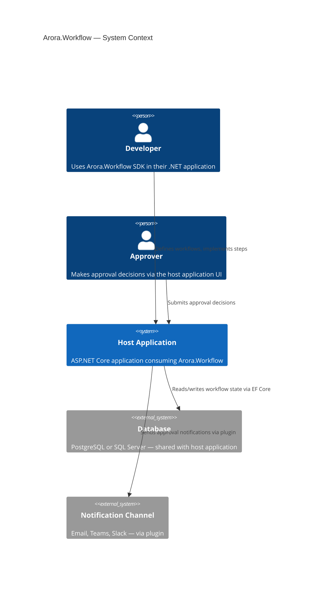
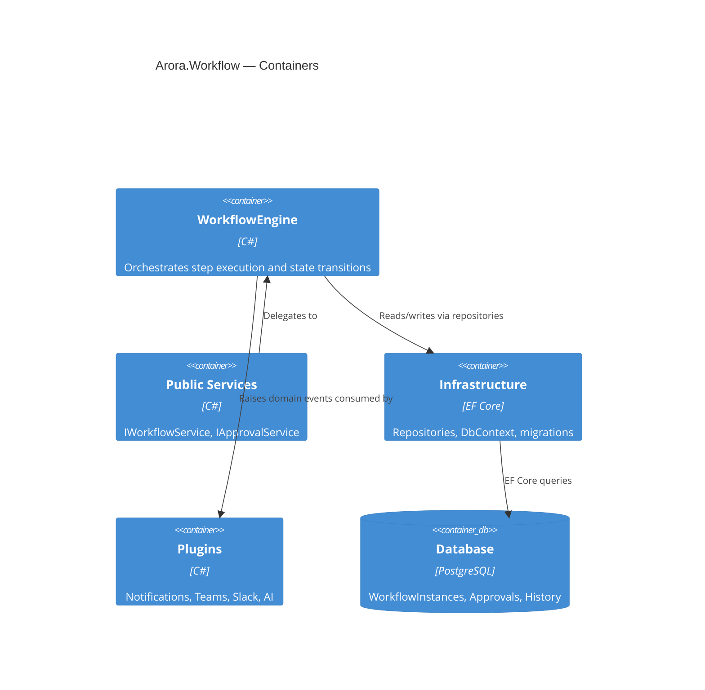

# Architecture
# Arora.Workflow

**Version**: 1.0
**Status**: Draft
**Date**: 2026-07-01

---

## 1. System Context

Arora.Workflow is an embedded SDK. It is not a separate service, not a separate deployment, and not a separate database. It runs inside the host application's process, using the host application's database connection, registered in the host application's dependency injection container.

```
┌─────────────────────────────────────────────────────────────────┐
│                    Host Application (ASP.NET Core)               │
│                                                                  │
│  ┌────────────────────┐    ┌──────────────────────────────────┐  │
│  │   Application Code  │    │         Arora.Workflow SDK        │  │
│  │                    │    │                                  │  │
│  │  InvoiceController │───▶│  IWorkflowService                │  │
│  │  ApprovalController│───▶│  IApprovalService                │  │
│  │  WorkflowDefinition│───▶│  WorkflowEngine                  │  │
│  └────────────────────┘    └──────────────┬───────────────────┘  │
│                                           │                       │
│                            ┌──────────────▼───────────────────┐  │
│                            │    EF Core (via host DbContext)   │  │
│                            └──────────────┬───────────────────┘  │
└───────────────────────────────────────────┼─────────────────────┘
                                            │
                             ┌──────────────▼──────────┐
                             │  PostgreSQL / SQL Server  │
                             └─────────────────────────┘
```

**The host application provides:**
- An EF Core `DbContext` (Arora.Workflow adds its entities to it)
- The dependency injection container (Arora.Workflow registers its services into it)
- Actor identity resolution (who is making the approval decision)
- Event handler implementations (what to do when a workflow event fires)

**Arora.Workflow provides:**
- The workflow engine (state machine execution)
- The persistence model (EF Core entities and migrations)
- The public API (`IWorkflowService`, `IApprovalService`)
- The domain event infrastructure (publish, subscribe)
- The escalation scheduler (deadline timers)

---

## 2. Internal Layer Architecture

Arora.Workflow follows Clean Architecture internally. The dependency rule flows inward: Infrastructure depends on Application; Application depends on Domain; Domain depends on nothing.

```
┌─────────────────────────────────────────────────┐
│                    Domain Layer                  │
│  WorkflowDefinition, WorkflowInstance            │
│  Domain Events, Value Objects                    │
│  No external dependencies                        │
└─────────────────────────────────────────────────┘
                        ▲
┌─────────────────────────────────────────────────┐
│                 Application Layer                │
│  WorkflowEngine, IWorkflowService                │
│  IApprovalService, Command/Query Handlers        │
│  Repository interfaces (defined, not implemented)│
│  Depends only on Domain                          │
└─────────────────────────────────────────────────┘
                        ▲
┌─────────────────────────────────────────────────┐
│               Infrastructure Layer               │
│  EF Core DbContext, Repositories (implemented)   │
│  EscalationScheduler (IHostedService)            │
│  MediatR event dispatching                       │
│  Depends on Application + Domain                 │
└─────────────────────────────────────────────────┘
                        ▲
┌─────────────────────────────────────────────────┐
│              Extension Points Layer              │
│  Plugin registration (IWorkflowPlugin)           │
│  Step middleware (IWorkflowMiddleware)            │
│  Event handler hooks (IWorkflowEventHandler<T>)  │
│  Definition sources (IWorkflowDefinitionSource)  │
└─────────────────────────────────────────────────┘
```

---

## 3. State Machine Engine

The heart of Arora.Workflow is a deterministic state machine engine.

### How It Works

1. The host application calls `IWorkflowService.StartAsync(request)`.
2. The engine loads the `WorkflowDefinition` (from cache or database).
3. The engine creates a `WorkflowInstance` in the initial state and persists it.
4. The engine evaluates which steps are available from the initial state and executes them.
5. Each step returns a result. The engine evaluates the transitions from the current state given the result.
6. The `TransitionEvaluator` identifies the valid next state (applying `TransitionGuard` predicates).
7. The engine transitions the instance, writes a `WorkflowHistory` entry, and persists.
8. If the next step is an Approval Step, the engine creates a pending `Approval` record and raises `ApprovalRequested`.
9. Execution pauses. The instance waits in `PendingApproval` state until an actor submits a decision.
10. When the actor calls `IApprovalService.ApproveAsync(approvalId, actor)`, the engine resumes from step 4.

### Transition Evaluation

The `TransitionEvaluator` ensures exactly one valid transition exists for any given trigger and current state. If zero transitions match, `InvalidTransitionException` is thrown. If more than one transition matches (ambiguous guards), `AmbiguousTransitionException` is thrown — this is a workflow definition authoring error.

```
Current State: PendingManagerApproval
Trigger: ApprovalGranted
Guards evaluated:
  → Guard 1: invoice.Amount <= 10000 → TRUE  → Transition to: ProcessPayment
  → Guard 2: invoice.Amount > 10000  → FALSE → (not eligible)
Result: Transition to ProcessPayment
```

### Optimistic Concurrency

`WorkflowInstance` uses EF Core's optimistic concurrency (`RowVersion` / `xmin` in PostgreSQL). Concurrent modifications to the same instance result in a `DbUpdateConcurrencyException`, which the engine handles with a retry-with-reload policy. This prevents two simultaneous approval decisions from corrupting the instance state.

---

## 4. Execution Model

### Step Execution

Steps are executed by the `StepExecutor` component within the Application layer. The executor:

1. Checks for an existing `StepResult` with the same `StepExecutionId` (idempotency check).
2. If found: returns the existing result without re-executing.
3. If not found: calls `IWorkflowStep<TInput, TOutput>.ExecuteAsync(input, ct)`.
4. On success: writes `StepResult` with `Status = Succeeded` and the step output.
5. On exception: checks the `RetryPolicy`. If retries remain, schedules a retry. If exhausted: writes `StepResult` with `Status = Failed` and raises `StepFailed`.

### Step Middleware Pipeline

Before a step executes, it passes through an ordered middleware pipeline. Middleware is registered via `AddAroraWorkflow().UseStepMiddleware<T>()`.

Built-in middleware (in order):
1. `LoggingMiddleware` — structured logging of step start/complete/fail
2. `IdempotencyMiddleware` — checks for existing `StepResult`
3. `RetryMiddleware` — handles retry scheduling on failure
4. `CorrelationMiddleware` — attaches correlation ID to the step execution context

Host applications may insert custom middleware at any position in the pipeline.

### Approval Step Execution

When the engine encounters an Approval Step:

1. A `Approval` record is created with `Status = Pending`, associated with the approver actor (or role).
2. `ApprovalRequested` domain event is raised (notification handlers send emails/Teams cards).
3. If an `EscalationPolicy` is defined, the `EscalationScheduler` registers a deadline timer.
4. The `WorkflowInstance` state is set to `PendingApproval`. Execution pauses.
5. Nothing further happens until the host application calls `IApprovalService.ApproveAsync()` or `RejectAsync()`.

---

## 5. Persistence Model

Arora.Workflow uses **EF Core with a shared DbContext model**. The host application's `DbContext` inherits from or composes `AroraWorkflowDbContext`, which provides the EF Core entity configurations for all Arora.Workflow tables.

### DbContext Integration

**Option A — Inheritance (recommended):**
```csharp
public class AppDbContext : AroraWorkflowDbContext
{
    // host application entities
    public DbSet<Invoice> Invoices => Set<Invoice>();
}
```

**Option B — Composition (for existing DbContext roots):**
```csharp
// In AppDbContext.OnModelCreating:
builder.ApplyAroraWorkflowConfiguration();
```

Both options result in Arora.Workflow tables being created in the same database as the host application entities. Arora.Workflow provides EF Core migrations that the host application includes in its own migration history.

### Global Query Filters

EF Core Global Query Filters are applied automatically by Arora.Workflow:

- **TenantId filter**: All queries are scoped to the current tenant, resolved from `ITenantContext`.
- **IsDeleted filter**: Soft-deleted records are excluded from all standard queries.

These filters are always active. Bypassing them requires explicit `.IgnoreQueryFilters()` with documented justification.

---

## 6. Plugin Architecture

The core `Arora.Workflow` package contains only the engine, persistence model, and public service interfaces. Everything else is a plugin.

```
Arora.Workflow                     ← core (always required)
  ↓
Arora.Workflow.Notifications       ← email/push via INotificationProvider
Arora.Workflow.Teams               ← Microsoft Teams adaptive cards
Arora.Workflow.Slack               ← Slack approval actions
Arora.Workflow.AI                  ← AI-assisted routing and escalation suggestions
Arora.Workflow.Dashboard           ← Blazor/React monitoring dashboard (Phase 4)
```

### Plugin Contract

```csharp
public interface IWorkflowPlugin
{
    string Name { get; }
    void ConfigureServices(IServiceCollection services, WorkflowOptions options);
    void Configure(IApplicationBuilder app);
}
```

Plugins are registered via the fluent builder:

```csharp
builder.Services.AddAroraWorkflow(options =>
{
    options.UseEntityFramework<AppDbContext>();
})
.AddTeamsNotifications(teams =>
{
    teams.WebhookUrl = configuration["Teams:WebhookUrl"];
})
.AddSlackNotifications(slack =>
{
    slack.BotToken = configuration["Slack:BotToken"];
});
```

### Extension Points

| Interface | Purpose | Registered Via |
|-----------|---------|----------------|
| `IWorkflowStep<TInput, TOutput>` | Implement a workflow step | Discovered by convention |
| `IWorkflowMiddleware` | Intercept step execution | `UseStepMiddleware<T>()` |
| `IWorkflowEventHandler<TEvent>` | Handle domain events | `INotificationHandler<T>` (MediatR) |
| `IWorkflowDefinitionSource` | Load definitions from external sources | `UseDefinitionSource<T>()` |
| `IWorkflowPlugin` | Bundle multiple extension points | `AddPlugin<T>()` |

---

## 7. Event Infrastructure

Domain events are dispatched using MediatR's `INotification` / `INotificationHandler<T>` pattern.

### Phase 1 (In-Process)

Events are dispatched synchronously within the same request/background service that caused the state change. Handlers run after the database transaction commits. If a handler fails, the failure is logged but does not roll back the workflow state change.

```
WorkflowInstance.Approve()
    → Database transaction commits
    → MediatR.Publish(new ApprovalGranted(...))
        → TeamsNotificationHandler.Handle()  // sends Teams card
        → AuditLogHandler.Handle()           // writes audit entry
        → EscalationCancellationHandler.Handle() // cancels pending timer
```

### Phase 2 (Promotable to Message Broker)

The event dispatching infrastructure is abstracted behind `IWorkflowEventPublisher`. In Phase 2, a `ServiceBusWorkflowEventPublisher` implementation replaces the in-process MediatR publisher, providing durability guarantees for event delivery.

---

## 8. Escalation Scheduler

### Phase 1 Implementation

The `EscalationScheduler` is an `IHostedService` that runs a polling loop on a configurable interval (default: 60 seconds). It queries the `WorkflowDeadlines` table for elapsed deadlines and fires `EscalationTimerElapsed` for each.

```sql
SELECT * FROM WorkflowDeadlines
WHERE FireAt <= NOW()
  AND IsProcessed = false
  AND TenantId = @tenantId
ORDER BY FireAt ASC
LIMIT 100;
```

### Phase 2 Migration Path

The hosted service poller is replaced by a durable scheduled message (Azure Service Bus scheduled messages, Quartz.NET with PostgreSQL persistence, or similar). The `IEscalationScheduler` interface is the abstraction; swapping implementations requires no changes to the engine.

---

## 9. Multi-Tenancy

Every entity in Arora.Workflow carries a `TenantId` (GUID). The current tenant is resolved from the `ITenantContext` service, which the host application implements and registers. Arora.Workflow does not define how tenants are identified — it only consumes the resolved `TenantId`.

```csharp
public interface ITenantContext
{
    TenantId CurrentTenantId { get; }
}
```

EF Core Global Query Filters ensure that no cross-tenant data leakage is possible through the standard repository and service APIs.

---

## 10. C4 Diagrams

### Context Diagram



### Container Diagram


