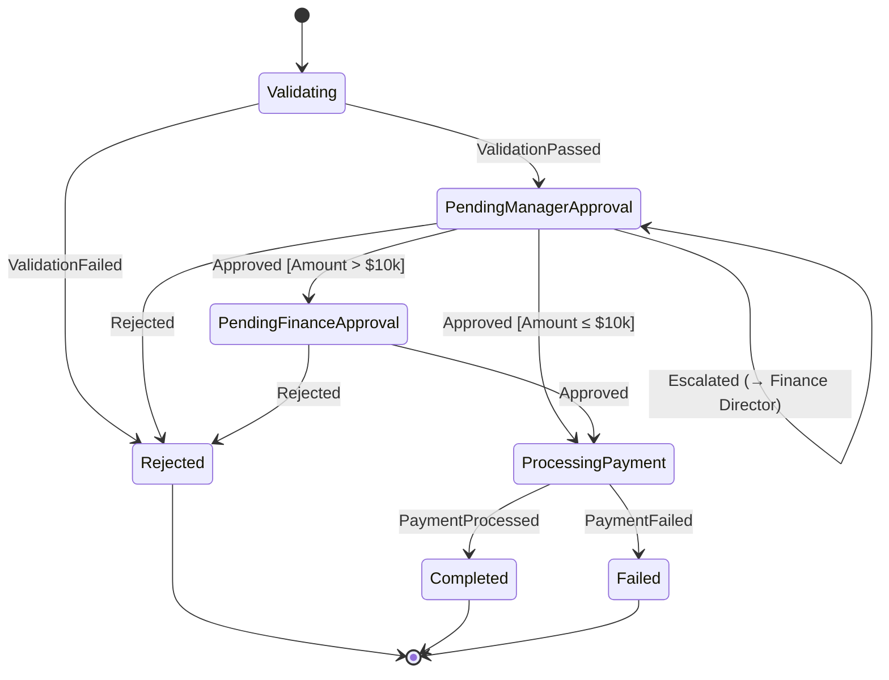
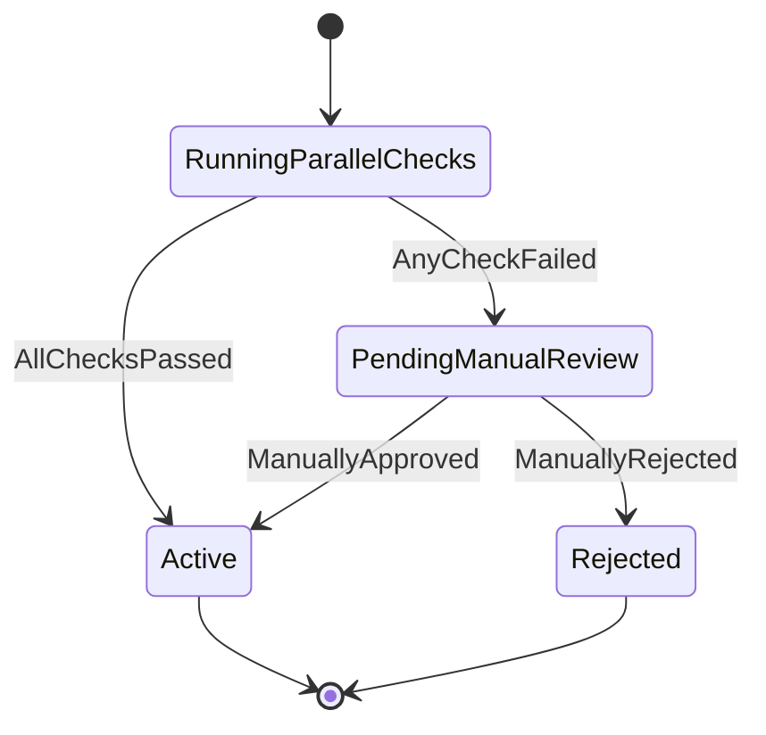
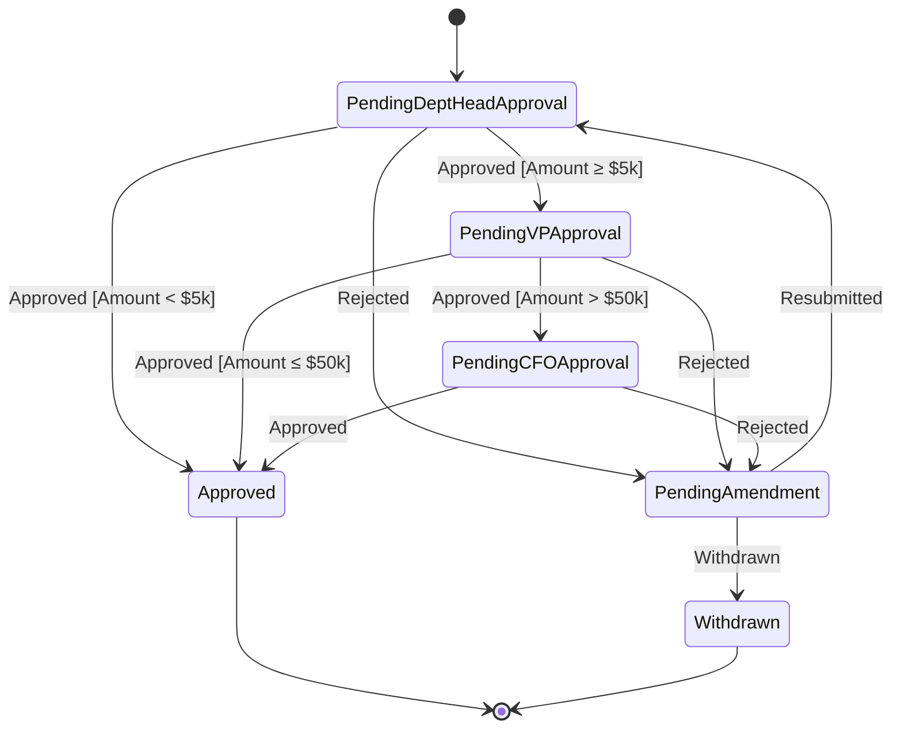
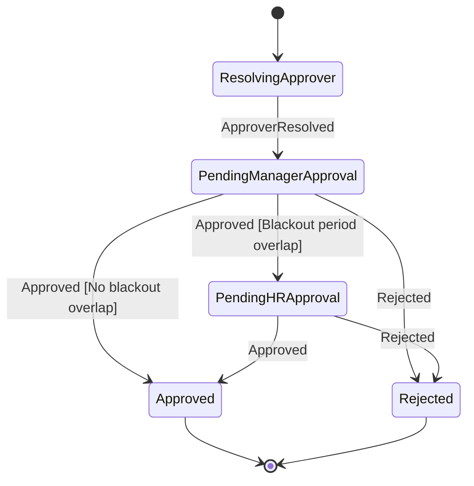

# Examples
# Arora.Workflow

**Version**: 1.0
**Status**: Draft
**Date**: 2026-07-01

---

> *These examples are the "killer demo."*
> *Every API decision in `PublicAPI.md` is validated here.*
> *If an example requires awkward code, the API is wrong — not the example.*

---

## Getting Started: From Zero to Running Workflow in 10 Minutes

This is the promise. Here is the proof.

### Step 1 — Install

```bash
dotnet add package Arora.Workflow
dotnet add package Arora.Workflow.EntityFramework
```

### Step 2 — Register

```csharp
// Program.cs
builder.Services.AddAroraWorkflow(options =>
{
    options.UseEntityFramework<AppDbContext>();
});

app.UseAroraWorkflow();
```

### Step 3 — Define

```csharp
// InvoiceApprovalWorkflow.cs
public class InvoiceApprovalWorkflow : IWorkflowDefinitionProvider
{
    public WorkflowDefinition GetDefinition() =>
        WorkflowDefinition
            .Create("invoice-approval")
            .Version(1)
            .WithStep<ValidateInvoiceStep>("validate")
            .WithApproval<ManagerApproval>("manager-approval")
                .AssignedTo(a => a.Role("Manager"))
                .OnApprove(next: "process-payment")
                .OnReject(next: "send-rejection")
                .WithEscalation(after: TimeSpan.FromDays(2), to: a => a.Role("FinanceDirector"))
            .WithStep<ProcessPaymentStep>("process-payment")
            .WithStep<SendRejectionStep>("send-rejection")
            .Build();
}
```

### Step 4 — Implement Steps

```csharp
public class ValidateInvoiceStep : IWorkflowStep<InvoiceInput, ValidationResult>
{
    public async Task<ValidationResult> ExecuteAsync(
        InvoiceInput input, CancellationToken ct)
    {
        // your validation logic
        return new ValidationResult(IsValid: true);
    }
}
```

### Step 5 — Start a Workflow

```csharp
// In your controller or command handler
var instance = await _workflowService.StartAsync(new StartWorkflowRequest
{
    WorkflowName = "invoice-approval",
    IdempotencyKey = $"invoice-{invoice.Id}",
    CorrelationId = invoice.Id.ToString(),
    Input = new InvoiceInput(invoice.Id, invoice.Amount, invoice.VendorId),
    InitiatedBy = new ActorInfo(currentUser.Id, currentUser.Name)
}, cancellationToken);
```

**That's it. Invoice approval is running.**

---

## Example 1 — Invoice Approval

### Business Problem

A vendor submits an invoice. A manager must approve it within 2 business days. If the invoice exceeds $10,000, finance approval is also required. If the manager does not act within 2 days, the request escalates to the Finance Director. Once approved, payment is processed automatically.

### State Diagram



### Workflow Definition

```csharp
WorkflowDefinition
    .Create("invoice-approval")
    .Description("Standard vendor invoice approval with dual-level finance escalation")
    .Version(1)

    // Step 1 — Validate the invoice before routing
    .WithStep<ValidateInvoiceStep>("validate")
        .Then("manager-approval")

    // Step 2 — Manager approval (always required)
    .WithApproval<ManagerApproval>("manager-approval")
        .AssignedTo(a => a.Dynamic(ctx => ctx.Input<InvoiceInput>().ManagerId))
        .OnApprove(next: "finance-approval")
        .OnReject(next: "send-rejection-notification")
        .WithEscalation(
            after: TimeSpan.FromDays(2),
            to: a => a.Role("FinanceDirector"),
            action: EscalationAction.Escalate)

    // Step 3 — Finance approval (only required for large invoices)
    .WithApproval<FinanceApproval>("finance-approval")
        .AssignedTo(a => a.Role("Finance"))
        .When(ctx => ctx.Input<InvoiceInput>().Amount > 10_000)
        .OnApprove(next: "process-payment")
        .OnReject(next: "send-rejection-notification")

    // Step 4 — Process the payment
    .WithStep<ProcessPaymentStep>("process-payment")
        .WithRetry(maxAttempts: 3, delay: TimeSpan.FromSeconds(30), backoff: BackoffStrategy.Exponential)
        .Then("send-approval-confirmation")

    // Step 5a — Notify of approval
    .WithStep<SendApprovalConfirmationStep>("send-approval-confirmation")

    // Step 5b — Notify of rejection
    .WithStep<SendRejectionNotificationStep>("send-rejection-notification")

    .Build();
```

### Key API Decisions

> **Why `.Dynamic(ctx => ctx.Input<InvoiceInput>().ManagerId)` for actor assignment?**
> The manager is not a static role — it is the specific manager associated with this invoice, known at runtime from the invoice data. The `Dynamic` resolver gives the definition access to the input payload while keeping the definition code-first and strongly typed.

> **Why is `finance-approval` conditional with `.When()`?**
> The finance step is only meaningful when `Amount > $10,000`. For invoices below that threshold, the transition from `manager-approval` skips directly to `process-payment`. This is a `TransitionGuard` — the engine evaluates it at runtime and routes accordingly.

> **Why does `process-payment` have a retry policy?**
> Payment processing involves an external API call. The `ExponentialBackoff` retry policy handles transient failures (API timeouts, momentary outages) without requiring the approver to re-approve. The step is idempotent — retrying never charges the vendor twice.

---

## Example 2 — Vendor Onboarding

### Business Problem

A new vendor submits their information. Three independent validations must be completed in parallel: legal entity verification, bank account validation, and compliance screening. Only when all three pass does the vendor move to active status. If any check fails, the vendor is placed on hold for manual review.

### State Diagram



### Workflow Definition

```csharp
WorkflowDefinition
    .Create("vendor-onboarding")
    .Description("New vendor registration with parallel compliance checks")
    .Version(1)

    .WithParallelGroup("compliance-checks")
        .WithStep<LegalEntityVerificationStep>("legal-check")
        .WithStep<BankAccountValidationStep>("bank-check")
        .WithStep<ComplianceScreeningStep>("compliance-check")
    .JoinOn(
        allPassed: next => "activate-vendor",
        anyFailed: next => "place-on-hold")

    .WithStep<ActivateVendorStep>("activate-vendor")

    .WithStep<PlaceVendorOnHoldStep>("place-on-hold")
        .Then("manual-review")

    .WithApproval<ComplianceReviewApproval>("manual-review")
        .AssignedTo(a => a.Role("ComplianceOfficer"))
        .OnApprove(next: "activate-vendor")
        .OnReject(next: "reject-vendor")

    .WithStep<RejectVendorStep>("reject-vendor")

    .Build();
```

### Key API Decisions

> **Why `.WithParallelGroup()` and `.JoinOn()`?**
> Parallel execution is a first-class primitive. The three compliance checks are independent — there is no reason to run them sequentially. The engine executes them concurrently and waits for all to complete before evaluating the join condition. `.JoinOn()` replaces a complex `if/else` routing structure with a readable intent declaration.

---

## Example 3 — Purchase Order

### Business Problem

A purchase order requires approval based on amount tiers: orders under $5,000 need department head approval only; $5,000–$50,000 need department head and VP; over $50,000 need all three levels up to CFO. A rejected PO at any level returns to the requester for amendment before re-submission.

### State Diagram



### Workflow Definition

```csharp
WorkflowDefinition
    .Create("purchase-order")
    .Description("Tiered purchase order approval based on amount")
    .Version(1)

    .WithApproval<DeptHeadApproval>("dept-head-approval")
        .AssignedTo(a => a.Dynamic(ctx => ctx.Input<PurchaseOrderInput>().DeptHeadId))
        .OnApprove(next: "vp-approval")
        .OnReject(next: "pending-amendment")
        .WithEscalation(after: TimeSpan.FromDays(3), to: a => a.Role("VP"))

    .WithApproval<VPApproval>("vp-approval")
        .AssignedTo(a => a.Dynamic(ctx => ctx.Input<PurchaseOrderInput>().VPId))
        .When(ctx => ctx.Input<PurchaseOrderInput>().Amount >= 5_000)
        .OnApprove(next: "cfo-approval")
        .OnReject(next: "pending-amendment")
        .WithEscalation(after: TimeSpan.FromDays(3), to: a => a.Role("CFO"))

    .WithApproval<CFOApproval>("cfo-approval")
        .AssignedTo(a => a.Role("CFO"))
        .When(ctx => ctx.Input<PurchaseOrderInput>().Amount > 50_000)
        .OnApprove(next: "complete")
        .OnReject(next: "pending-amendment")

    .WithStep<MarkApprovedStep>("complete")

    .WithStep<RequestAmendmentStep>("pending-amendment")
        .AllowResubmission(resubmitTo: "dept-head-approval")

    .Build();
```

### Key API Decisions

> **Why `.AllowResubmission(resubmitTo: "dept-head-approval")` on the amendment step?**
> Rejection loops are a real business pattern. The requester amends their PO and re-submits. Rather than treating this as a new workflow instance (which would lose history), the engine supports looping back to an earlier step. The full amendment history remains in `WorkflowHistory`.

---

## Example 4 — Leave Request

### Business Problem

An employee requests leave. Their direct manager approves. If the manager is on leave themselves, an automatic substitution redirects the request to the manager's backup. If the leave request overlaps with a team blackout period, HR approval is also required.

### State Diagram



### Workflow Definition

```csharp
WorkflowDefinition
    .Create("leave-request")
    .Description("Employee leave request with automatic manager substitution and HR oversight")
    .Version(1)

    // Step 1 — Resolve the correct approver (handles manager-on-leave scenario)
    .WithStep<ResolveApproverStep>("resolve-approver")
        .Then("manager-approval")

    // Step 2 — Manager approval (approver identity resolved dynamically)
    .WithApproval<ManagerLeaveApproval>("manager-approval")
        .AssignedTo(a => a.Dynamic(ctx => ctx.GetStepOutput<ResolveApproverStep>().ApproverId))
        .OnApprove(next: "hr-approval")
        .OnReject(next: "send-rejection")
        .WithEscalation(after: TimeSpan.FromDays(1), to: a => a.Dynamic(
            ctx => ctx.GetStepOutput<ResolveApproverStep>().BackupApproverId))

    // Step 3 — HR approval (only when overlapping a blackout period)
    .WithApproval<HRLeaveApproval>("hr-approval")
        .AssignedTo(a => a.Role("HR"))
        .When(ctx => ctx.GetStepOutput<ResolveApproverStep>().OverlapsBlackout)
        .OnApprove(next: "notify-approved")
        .OnReject(next: "send-rejection")

    .WithStep<SendApprovalNotificationStep>("notify-approved")
    .WithStep<SendRejectionNotificationStep>("send-rejection")

    .Build();
```

### Key API Decisions

> **Why `.Dynamic(ctx => ctx.GetStepOutput<ResolveApproverStep>().ApproverId)` for escalation too?**
> The backup approver — determined during `ResolveApproverStep` — is the correct escalation target when the primary approver does not act. `ctx.GetStepOutput<T>()` gives the definition access to any previous step's output, enabling rich routing logic without coupling the definition to business rule implementation details.

> **Why a dedicated `ResolveApproverStep` instead of resolving in the approval step itself?**
> The Manifesto principle: *workflow should be understandable*. By making approver resolution an explicit, named step, the definition reads as: "First, figure out who should approve. Then, ask them." The step's logic (checking if the manager is on leave, finding their backup) is unit-testable in isolation.
